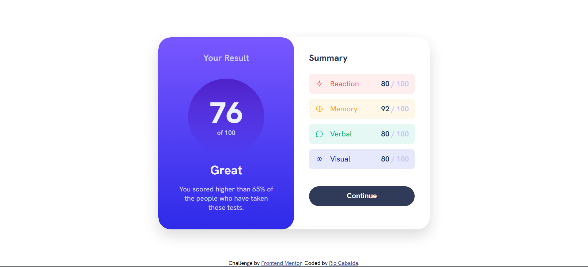
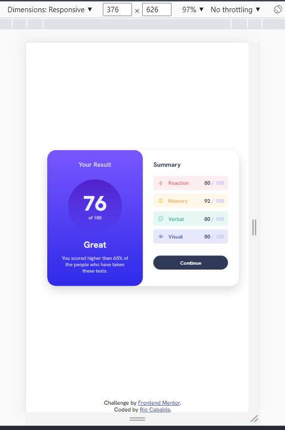

# Frontend Mentor - QR code component solution

This is a solution to the [QR code component challenge on Frontend Mentor](https://www.frontendmentor.io/challenges/qr-code-component-iux_sIO_H). Frontend Mentor challenges help you improve your coding skills by building realistic projects. 

## Table of contents

- [Overview](#overview)
  - [Screenshot](#screenshot)
  - [Links](#links)
- [My process](#my-process)
  - [Built with](#built-with)
  - [What I learned](#what-i-learned)
- [Author](#author)

 -Desktop view
 

 -Mobile view
 


### Links

- Solution URL: [URL...](https://rjcabalda.github.io/results-summary-component/index.html)
- Live Site URL: [URL...](https://rjcabalda.github.io/results-summary-component/index.html)

## My process
- set up the mark up.
- styling the with and height of the container.
- aligning the child element in the container by using flexbox.
- setting color using css variables
- setting font weight and font sizes.

### Built with

- Semantic HTML5 markup
- CSS custom properties
- CSS variables
- Flexbox
- desktop-first workflow

### What I learned

  Building a projects make me grow my web development skills. Practicing best practice in coding and using flexbox is very useful and handy for the design of this project.

To see how you can add code snippets, see below:

```html
        <div class="container">

             <div class="result">
                <h3 class="result__heading--1">Your Result</h3>
                <div class="result__score">
                    <h1 class="score">76</h1> 
                    <span class="total-score">of 100</span>
                </div>
                <h2 class="result__heading--2">Great</h2>
            <p class="paragraph">You scored higher than 65% of the people who have taken these tests.</p>
    </div>
```
```css

:root {
    /* Primary */

--Light-red: hsl(0, 100%, 67%);
--Orangey-yellow: hsl(39, 100%, 56%);
--Green-teal: hsl(166, 100%, 37%);
--Cobalt-blue: hsl(234, 85%, 45%);

/* ## Gradients */

--Light-slate-blue: hsl(252, 100%, 67%);  /*(background) */
--Light-royal-blue: hsl(241, 81%, 54%);  /*(background) */

--Violet-blue: hsla(256, 72%, 46%, 1);  /*(circle)*/
--Persian-blue: hsla(241, 72%, 46%, 0); /*(circle)*/


/* ### Neutral */

--White: hsl(0, 0%, 100%);
--Pale-blue: hsl(221, 100%, 96%);
--Light-lavender: hsl(241, 100%, 89%);
--Dark-gray-blue: hsl(224, 30%, 27%);

--attribution: hsl(228, 45%, 44%);
}

.container {
    width: 55rem;
    height: 39rem;
    border-radius: 2.5rem;
    background-color: var(--White);
    box-shadow: 0 1.2rem 3rem rgba(0, 0, 0, 0.15);
    overflow: hidden;
    display: flex;
}

```
```js

```

## Author

- Website - [Rio Cabalda](https://rjcabalda.github.io/results-summary-component/index.html)
- Frontend Mentor - [@rjcabalda](https://www.frontendmentor.io/profile/rjcabalda)


